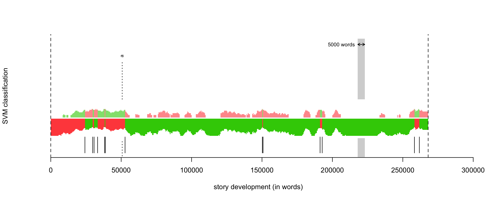
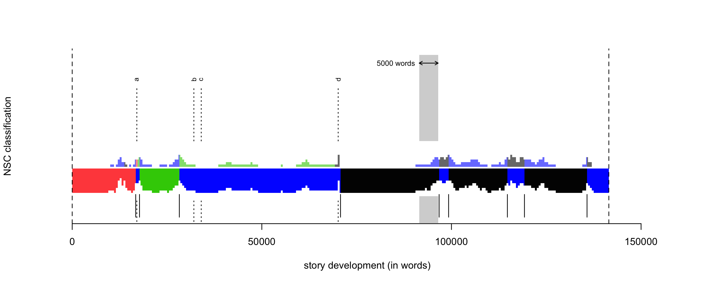
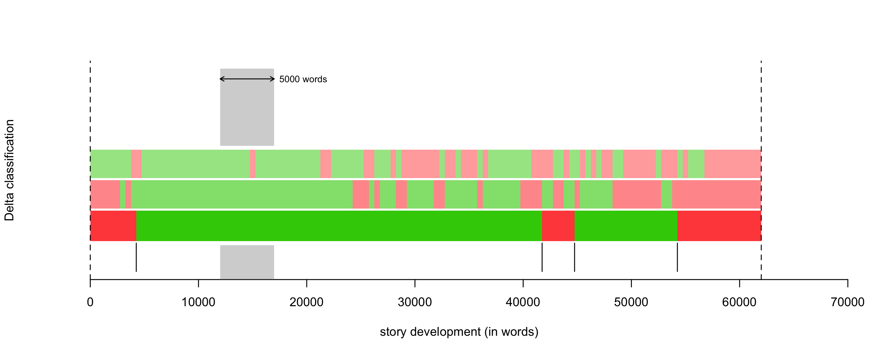

Testing rolling stylometry
================
Maciej Eder
8/10/2014

The following sections briefly introduce a new stylometric method (Eder,
2015) that combines supervised machine-learning classification with the
idea of sequential analysis. Unlike standard procedures, aimed at
assessing style differentiation between discrete text samples, the new
method, supported with compact visualization, tries to look inside a
text represented as a set of linearly sliced chunks, in order to test
their stylistic consistency. Three flavors of the method have been
introduced: (i) Rolling SVM, relying on the support vector machines
classifier, (ii) Rolling NSC, based on the nearest shrunken centroids
method, and (iii) Rolling Delta, using the classic Burrowsian measure of
similarity. The technique is primarily intended to assess mixed
authorship; however, it can be also used as a magnifying glass to
inspect works with unclear stylometric signal. To test its
applicability, three different examples of collaborative work have been
examined: (i) the 13th-century French allegorical poem “Roman de la
Rose”, (ii) a 15th-century translation of the Bible into Polish known
as “Queen Sophia’s Bible”, and (iii) “The Inheritors”, a novel
collaboratively written by Joseph Conrad and Ford Madox Ford in 1901.

Supposing there is a work written collaboratively – i.e. a text in which
some authorial takeovers are suspected to have happened – the procedure
starts with chunking the text into consecutive samples, or equal-size
blocks of *N* words (tokens). Arguably, any classification method can be
rolled through these blocks, in the present study, however, three
supervised classification techniques known for their high accuracy were
used: SVM, NSC, and Delta. Even if they rely on substantially different
mathematical kernels, SVM, NSC and Delta use exactly the same corpus
setup to carry out the classification. Namely, a number of
representative samples for each class is expected to constitute a
reference set (training set), while the remaining samples, including
anonymous ones, go to a test set. Next, each sample from the test set is
checked against the training set in order to identify the most similar
authorial profile (i.e. the best matched training class). In rolling
stylometry, roughly the same setup is used. The only difference is that
instead of several samples, the test set contains a single work to be
chunked automatically into equal-sized segments.

The final stage of the analysis involves a graphical representation of
stylistic changes throughout a chunked text. A simple home-brew graph
has been used. To keep the plot clean, any redundant information have
been removed. The goal was to emphasize visually the most likely
candidate – i.e. the actual answer of the classifier – and to keep less
probable candidates slightly in the shadow. To this end, horizontal
stripes colored according to the assigned class were used, the primary
stripe bold.

 *Fig. 1: Roman de
la Rose assessed using Rolling SVM and 100 MFWs; window size: 5,000
words, sample overlap: 4,500 words. Sections attributed to Guillaume de
Lorris are marked red, those attributed to Jean de Meun are green. The
level of certainty of the classification is indicated by the thickness
of the bottom stripe. The commonly-accepted division into two parts is
marked with a vertical dashed line.*

 *Fig. 2:
Queen Sophia’s Bible assessed using Rolling NSC and 50 MFWs. Sections
attributed to 1st, 2nd, 4th and 5th scribe are marked red, green, blue
and black, respectively.*


*Fig. 3: The Inheritors by Conrad/Ford assessed using Rolling Delta and
1,000 MFWs. The bottom stripe indicates the first ranked candidate
(i.e. the most probable), then comes the second and the third suggested
class. Sections attributed to Ford are marked green, the red ones are
for Conrad.*


*Fig. 4: The Inheritors by Conrad/Ford assessed using Rolling Delta and
500 MFWs.*

## Further reading

The above procedure is described in detail in the following paper: Eder,
M. (2015). Rolling stylometry. Digital Scholarship in the Humanities,
31(3), 457-469. \[pre-print\].

## The code

The rolling stylometry technique is supported by the R package `stylo`
(ver. \>=0.5.8), through the function `rolling.classify()`. However,
since the function is not supplemented by GUI yet, it might look
non-intuitive. This appendix provides a concise step-by-step howto
explaining its usage. To reproduce the plots as shown above, follow
these steps:

1.  Install the package stylo in the version \>= 0.5.8. Click **here**
    for further details.

2.  Create a new folder: it will serve as a working space for your
    experiment. Create two subfolders named `test_set` and
    `reference_set` (all file names are case sensitive\!). Put your
    disputed text into the `test_set`, put the remaining texts into the
    `reference_set`. The setup for the Conrad/Ford case was as follows:

<!-- end list -->

    reference_set 
        Conrad_Chance_1913.txt 
        Conrad_Heart_1899.txt 
        Conrad_Lord_1900.txt 
        Conrad_Nigger_1897.txt 
        Conrad_Victory_1915.txt 
        Conrad_Western_1911.txt 
        Ford_Apollo_1908.txt 
        Ford_Benefactor_1905.txt 
        Ford_Girl_1907.txt 
        Ford_Nancy_1911.txt 
        Ford_Seal_1907.txt 
        Ford_Soldier_1915.txt 
    
    test_set 
        Conford_Inheritors_1901.txt 

The complete setup for the Roman de la Rose case can be downloaded from
**here**.

3.  Load the library `stylo`, set your working directory:

<!-- end list -->

``` r
library(stylo) 
setwd("path/to/the/folder/containing/two/subcorpora") 
```

4.  Optional but important: read the help page for the function
    `rolling.classify()`:

<!-- end list -->

``` r
help(rolling.classify) 
```

5.  Run the function `rolling.classify()`, use as many arguments as
    needed:

<!-- end list -->

``` r
# Fig. 1
rolling.classify(write.png.file = TRUE, classification.method = "svm", mfw=100, training.set.sampling = "normal.sampling", slice.size = 5000, slice.overlap = 4500) 
```

The vertical dashed line that divides the part by Guillaume de Lorris
and Jean de Meun is produced by adding the word “xmilestone” into the
input text, after the line 4,058. One can add as many milestones as
needed; they will be reproduced in the final plot and labelled
automatically using lowercase roman letters.

``` r
# Fig. 2
rolling.classify(write.png.file = TRUE, classification.method = "nsc", mfw=50, training.set.sampling = "normal.sampling", slice.size = 5000, slice.overlap = 4500) 

# Fig. 3
rolling.classify(write.png.file = TRUE, classification.method = "delta", mfw=1000) 

# Fig. 4
rolling.classify(write.png.file = TRUE, classification.method = "delta", mfw=500) 
```

## References

<div id="refs" class="references">

<div id="ref-eder_rolling_2015">

**Eder, M.** (2015). Rolling stylometry. *Digital Scholarship in the
Humanities*, **31**(3): 457–69.

</div>

</div>
